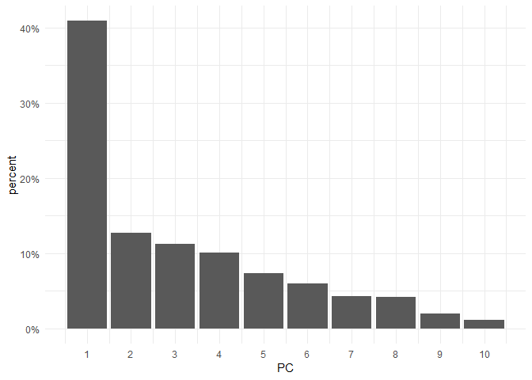
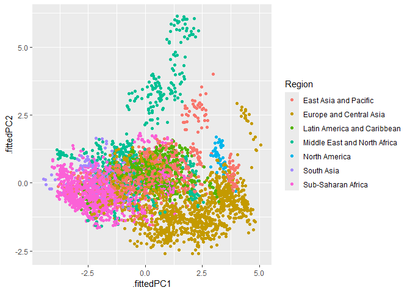
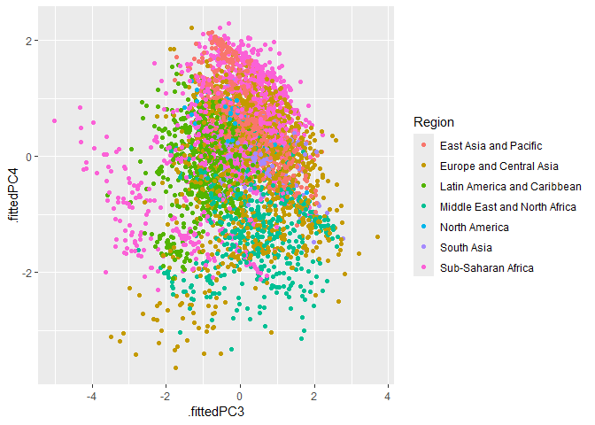
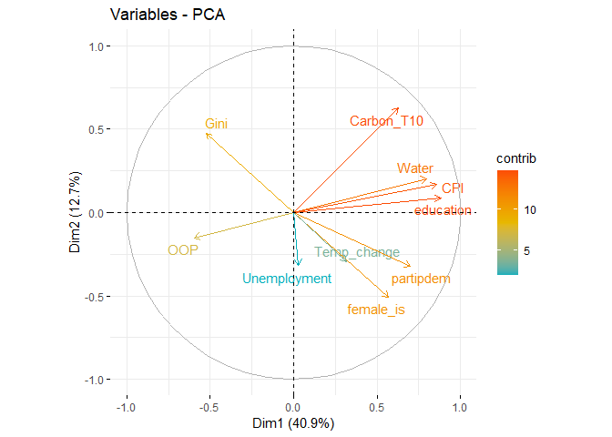

ASWell_Index
================
Julia Gorny
2023-05-01

\#Loading the data Here I am loading the data set. In this dataset I
actually deleted the GPI (global peace index) variable

``` r
df <- read.csv("data_10_variables.csv", header = TRUE, sep = ",") %>%
  select(-any_of(c("X", "X.1")))
```

\#Imputing the data Originally I imputed data using the mean but now I
try imputation using missRanger, a random forest imputation which gains
more and more popularity recently

``` r
df_imputed <- missRanger(df, num.trees = 100, verbose = 0)
```

\#Getting some insight into the data:

``` r
DataExplorer::create_report(df_imputed %>% select(OOP:Temp_change)) #this creates different plots for the data (I excluded all character variable to have only the different variables plotted against each other; If I plot this for everything it give some nice insights into the regional distributions though)
```

    ## 
    ## 
    ## processing file: report.rmd

    ##   |                                             |                                     |   0%  |                                             |.                                    |   2%                                   |                                             |..                                   |   5% [global_options]                  |                                             |...                                  |   7%                                   |                                             |....                                 |  10% [introduce]                       |                                             |....                                 |  12%                                   |                                             |.....                                |  14% [plot_intro]                      |                                             |......                               |  17%                                   |                                             |.......                              |  19% [data_structure]                  |                                             |........                             |  21%                                   |                                             |.........                            |  24% [missing_profile]                 |                                             |..........                           |  26%                                   |                                             |...........                          |  29% [univariate_distribution_header]  |                                             |...........                          |  31%                                   |                                             |............                         |  33% [plot_histogram]                  |                                             |.............                        |  36%                                   |                                             |..............                       |  38% [plot_density]                    |                                             |...............                      |  40%                                   |                                             |................                     |  43% [plot_frequency_bar]              |                                             |.................                    |  45%                                   |                                             |..................                   |  48% [plot_response_bar]               |                                             |..................                   |  50%                                   |                                             |...................                  |  52% [plot_with_bar]                   |                                             |....................                 |  55%                                   |                                             |.....................                |  57% [plot_normal_qq]                  |                                             |......................               |  60%                                   |                                             |.......................              |  62% [plot_response_qq]                |                                             |........................             |  64%                                   |                                             |.........................            |  67% [plot_by_qq]                      |                                             |..........................           |  69%                                   |                                             |..........................           |  71% [correlation_analysis]            |                                             |...........................          |  74%                                   |                                             |............................         |  76% [principal_component_analysis]    |                                             |.............................        |  79%                                   |                                             |..............................       |  81% [bivariate_distribution_header]   |                                             |...............................      |  83%                                   |                                             |................................     |  86% [plot_response_boxplot]           |                                             |.................................    |  88%                                   |                                             |.................................    |  90% [plot_by_boxplot]                 |                                             |..................................   |  93%                                   |                                             |...................................  |  95% [plot_response_scatterplot]       |                                             |.................................... |  98%                                   |                                             |.....................................| 100% [plot_by_scatterplot]           

    ## output file: C:/Users/julia/OneDrive/Dokumente/Wichtiges, Orga/Applications/Code Samples/ASWell_Index/report.knit.md

    ## "C:/Program Files/RStudio/resources/app/bin/quarto/bin/tools/pandoc" +RTS -K512m -RTS "C:/Users/julia/OneDrive/Dokumente/Wichtiges, Orga/Applications/Code Samples/ASWell_Index/report.knit.md" --to html4 --from markdown+autolink_bare_uris+tex_math_single_backslash --output pandoc67301b064e3a.html --lua-filter "C:\Users\julia\AppData\Local\R\win-library\4.3\rmarkdown\rmarkdown\lua\pagebreak.lua" --lua-filter "C:\Users\julia\AppData\Local\R\win-library\4.3\rmarkdown\rmarkdown\lua\latex-div.lua" --embed-resources --standalone --variable bs3=TRUE --section-divs --table-of-contents --toc-depth 6 --template "C:\Users\julia\AppData\Local\R\win-library\4.3\rmarkdown\rmd\h\default.html" --no-highlight --variable highlightjs=1 --variable theme=yeti --mathjax --variable "mathjax-url=https://mathjax.rstudio.com/latest/MathJax.js?config=TeX-AMS-MML_HTMLorMML" --include-in-header "C:\Users\julia\AppData\Local\Temp\RtmpQhltK6\rmarkdown-str6730677b5525.html"

    ## 
    ## Output created: report.html

\#Doing the PCA: Within this step, the data already gets normalised
(scaled)

``` r
pca_data <- df_imputed %>% 
  select(where(is.numeric)) %>% # retain only numeric columns
  select(-Year) %>%  # remove the year variable
  scale() %>% # scale data
  prcomp() # do PCA

# This shows the weightings of the variables 
# for the different PCAs
pca_data$rotation
```

    ##                      PC1         PC2          PC3         PC4         PC5
    ## OOP          -0.29440893 -0.13388049  0.251692984 -0.23477157  0.72221101
    ## Water         0.39421313  0.18181295 -0.013420998 -0.30796949  0.34949248
    ## CPI           0.42431269  0.14976688 -0.031398509  0.14050168 -0.02634458
    ## partipdem     0.34648102 -0.28648581 -0.218922402  0.34104511  0.10366265
    ## Unemployment  0.01478987 -0.28221598 -0.535417534 -0.70375241 -0.15503609
    ## Gini         -0.25965045  0.42210415 -0.386088592 -0.05969423 -0.19517987
    ## female_is     0.28156733 -0.45118531 -0.205855015  0.19176551  0.01209266
    ## education     0.43599280  0.07764453  0.002716264 -0.22845902  0.21112690
    ## Carbon_T10    0.31010397  0.55616230  0.109723898 -0.10167023 -0.05691442
    ## Temp_change   0.15702729 -0.26035496  0.630395351 -0.34036654 -0.48449444
    ##                      PC6          PC7         PC8          PC9         PC10
    ## OOP          -0.13318037  0.002806645  0.48188457  0.045433258  0.057635125
    ## Water        -0.14496695  0.247729784 -0.34275504  0.009503194 -0.628023048
    ## CPI           0.22325782  0.004207555  0.42224200  0.739030722 -0.042326407
    ## partipdem     0.13291454  0.549549221  0.32876843 -0.440740882  0.029668553
    ## Unemployment  0.26918482 -0.097312992  0.17734991 -0.027866225  0.000116851
    ## Gini         -0.59514740  0.374117032  0.24336534  0.092525967  0.041653580
    ## female_is    -0.61378812 -0.488115483  0.07599502  0.022406665 -0.128783707
    ## education    -0.18674265  0.085415703 -0.28899397  0.049637887  0.760891609
    ## Carbon_T10    0.03079431 -0.420187397  0.38214476 -0.495035632 -0.017406084
    ## Temp_change  -0.23349387  0.255062031  0.19473625 -0.007920729 -0.044879905

``` r
# This shows the original dataset AND the PCA's 
pca_data %>%
  augment(df_imputed) %>%
  head()
```

    ## # A tibble: 6 × 25
    ##   .rownames Country   Year ISO3  Region   OOP Water   CPI partipdem Unemployment
    ##   <chr>     <chr>    <int> <chr> <chr>  <dbl> <dbl> <dbl>     <dbl>        <dbl>
    ## 1 1         Afghani…  2000 AFG   South…  80.3  15.4  19.6      0.01         8.05
    ## 2 2         Afghani…  2001 AFG   South…  80.4  15.4  19.8      0.02         8.04
    ## 3 3         Afghani…  2002 AFG   South…  85.4  16.4  19.4      0.09         8.19
    ## 4 4         Afghani…  2003 AFG   South…  86.1  17.4  19.9      0.1          8.12
    ## 5 5         Afghani…  2004 AFG   South…  84.5  18.4  19.7      0.11         8.05
    ## 6 6         Afghani…  2005 AFG   South…  79.0  19.4  25        0.14         8.11
    ## # ℹ 15 more variables: Gini <dbl>, female_is <dbl>, education <dbl>,
    ## #   Carbon_T10 <dbl>, Temp_change <dbl>, .fittedPC1 <dbl>, .fittedPC2 <dbl>,
    ## #   .fittedPC3 <dbl>, .fittedPC4 <dbl>, .fittedPC5 <dbl>, .fittedPC6 <dbl>,
    ## #   .fittedPC7 <dbl>, .fittedPC8 <dbl>, .fittedPC9 <dbl>, .fittedPC10 <dbl>

``` r
# showing the "importance" of each PC:
pca_data %>%
  tidy(matrix = "eigenvalues")
```

    ## # A tibble: 10 × 4
    ##       PC std.dev percent cumulative
    ##    <dbl>   <dbl>   <dbl>      <dbl>
    ##  1     1   2.02   0.409       0.409
    ##  2     2   1.13   0.127       0.536
    ##  3     3   1.06   0.112       0.648
    ##  4     4   1.00   0.101       0.749
    ##  5     5   0.861  0.0740      0.823
    ##  6     6   0.772  0.0596      0.882
    ##  7     7   0.659  0.0435      0.926
    ##  8     8   0.652  0.0425      0.968
    ##  9     9   0.445  0.0198      0.988
    ## 10    10   0.346  0.012       1

``` r
# This is the scree plot
pca_data %>%
  tidy(matrix = "eigenvalues") %>%
  ggplot(aes(PC, percent)) +
  geom_col() +
  scale_x_continuous(breaks=1:15 ) +
  scale_y_continuous(
    labels = scales::percent_format())  + theme_minimal() 
```

<!-- -->

``` r
#this gives an insight into regional distributions
pca_data %>%
  augment(df_imputed) %>% 
  # add original dataset back in
  ggplot(aes(.fittedPC1, .fittedPC2, color=Region)) + 
  geom_point(size = 1.5)
```

<!-- -->

``` r
pca_data %>%
  augment(df_imputed) %>% 
  # add original dataset back in
  ggplot(aes(.fittedPC3, .fittedPC4, color=Region)) + 
  geom_point(size = 1.5)
```

<!-- -->

``` r
#ordinary biplot
fviz_pca_var(pca_data,
             col.var = "contrib", # Color by contributions to the PC
             gradient.cols = c("#00AFBB", "#E7B800", "#FC4E07"),
             repel = TRUE     # Avoid text overlapping
             )
```

<!-- -->

# normalise the data so that all variables are positive and comparable:

``` r
min_max_scaled <- df_imputed %>%
  select(where(is.numeric)) %>% # retain only numeric columns
  select(-Year) %>%
  apply(2, function(x) {
    (x - min(x)) / (max(x) - min(x))
  })

#Aggregating the standardised variables into one indicator using the a multi-criteria approach (TOPSIS), within this approach the data gets weighted equally, however directional weighting (impact weighting) will be applied:
impacts <- c(OOP = "-", Water = "+", CPI = "+", partipdem = "+",
             Unemployment = "-", Gini = "-", female_is = "+",
             education = "+", Carbon_T10 = "-", Temp_change = "-")
stopifnot(identical(names(impacts), colnames(min_max_scaled)))


# Calculate the TOPSIS scores with equal weights for all variables and only considering the directional weighting
ASWell_topsis <- topsis(min_max_scaled,
                        weights = rep(1/ncol(min_max_scaled), ncol(min_max_scaled)),
                        impacts = unname(impacts))

#add the my_topsis to the imputed data frame
All_data_ASWell <- cbind(df_imputed, ASWell_topsis)

#download full data
write_csv(All_data_ASWell, 'All_data_ASWell.csv') #this data set shows the data with all the variables and the index scores for each country and yea
```
